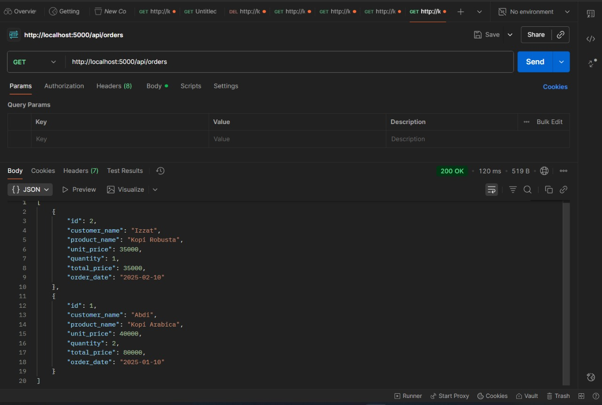
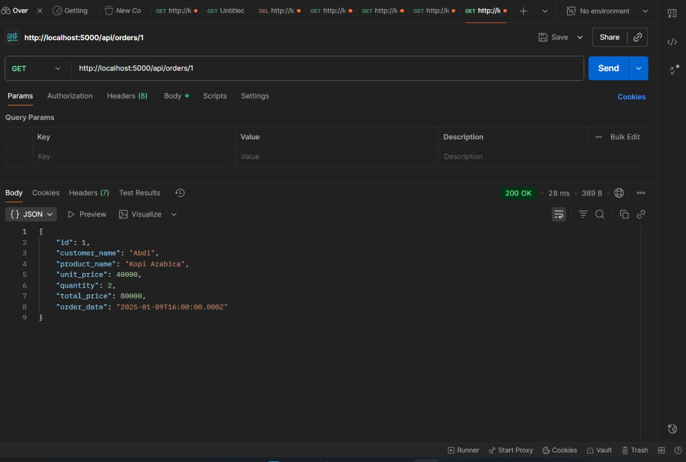
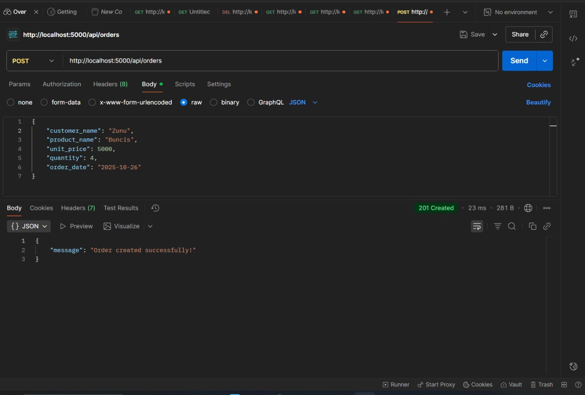
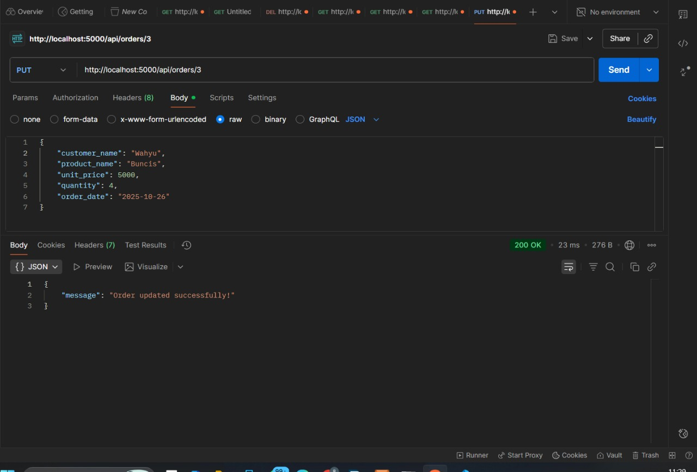
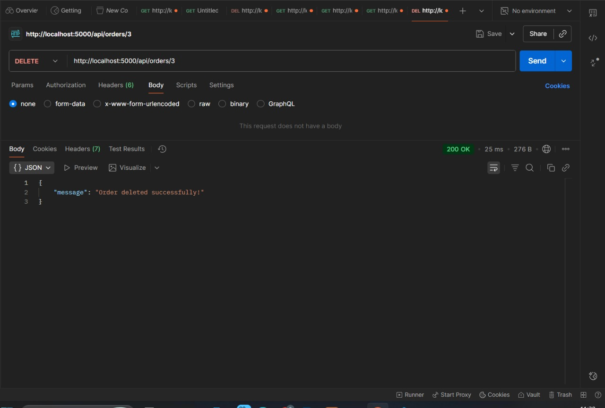
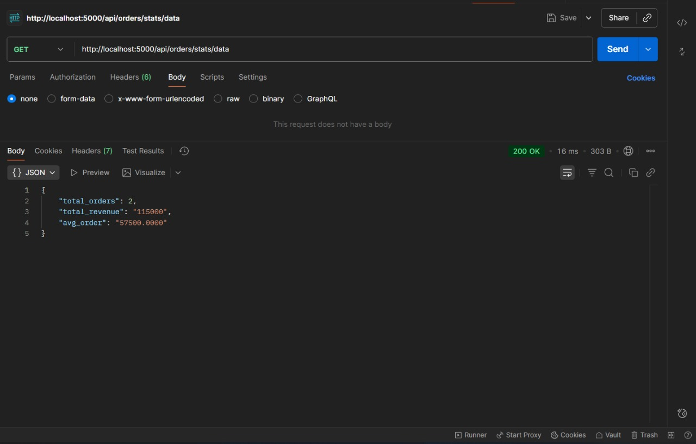

# pwl25-mini-project
---
## Identitas
- **Nama**: M. Wahyu Hilal Abroor
- **NIM**: F1D02310123
- Link YouTube : https://youtu.be/y-4_ra1FwSM?si=xcohuO71hx9VcBgA
---

## Deskripsi Singkat
Tugas ini adalah mini-project UTS mata kuliah Pemrograman Web Lanjut. Disini saya membuat sebuah program yang menerapakan REST API CRUD sederhana menggunakan Node.js + Express dan MySQL. Fungsinya untuk mengelola resource "orders" dengan operasi CRUD dan endpoint statistik dasar.

## Tujuan Tugas
- Membangun API RESTful sederhana untuk manajemen order.
- Menghubungkan aplikasi Node.js ke database MySQL.
- Mempraktikkan struktur proyek backend, routing, controller, dan model.
- Menyusun dokumentasi dan langkah setup agar dapat dijalankan di lingkungan lokal.

## Langkah Pengerjaan
1. Buat folder proyek dengan keyword:
   - d:\SEMESTER 5\WEB LANJUT\TUGAS UTS\mkdir pwl25-mini-project
2. Inisialisasi npm:
   - npm init -y
3. Install dependency:
   - npm install express mysql2 dotenv morgan body-parser
   - npm install --save-dev nodemon
4. Buat struktur folder:
    pwl25-mini-project/
    │
    ├── src/
    │   ├── config/
    │   │   └── db.js
    │   ├── controllers/
    │   │   └── orderController.js
    │   ├── middleware/
    │   │   ├── errorHandler.js
    │   │   ├── logger.js
    │   │   └── validate.js
    │   ├── models/
    │   │   └── orderModel.js
    │   ├── routes/
    │   │   └── orderRoutes.js
    │   └── app.js
    │
    ├── .env
    ├── .gitignore
    ├── package.json
    ├── package-lock.json
    ├── seed.sql
    ├── request.log
    ├── README.md
    └── screenshot/ 

5. Buat file SQL untuk membuat database dan tabel. Terdapat pada file order.sql
6. Implementasikan koneksi DB menggunakan mysql2 dan dotenv. Terdapat pada file models/db.js
7. Implementasikan model untuk query CRUD. Terdapat pada file models/orderModel.js
8. Buat controller untuk mengeksekusi logika endpoint. Terdapat pada controllers/ordersController.js
9. Daftarkan route di src/app.js dan jalankan server  dengan npm run dev.

## Database
Tabel: orders
- id INT AUTO_INCREMENT PRIMARY KEY
- customer_name VARCHAR(100)
- product_name VARCHAR(100)
- unit_price INT
- quantity INT
- total_price INT
- order_date DATE

## Penjelasan Bagian-Bagian Utama
Berikut adalah penjelasan singkat untuk setiap file berdasarkan struktur proyek:

1. src/config/db.js: Menghubungkan aplikasi ke database MySQL menggunakan mysql2 dengan konfigurasi dari .env.

2. src/models/orderModel.js: Menangani semua operasi database untuk resource orders (CRUD). Fungsi-fungsi di sini menjalankan query SQL seperti getAllOrders, getOrderById, createOrder, updateOrder, deleteOrder, dan getStats.

3. src/controllers/orderController.js: Berisi logika bisnis untuk endpoint orders. Controller membaca req.params atau req.body, memanggil fungsi model, dan mengembalikan response JSON. Juga menangani kasus error dasar seperti data tidak ditemukan.

4. src/routes/orderRoutes.js: Mendefinisikan route untuk resource /api/orders dan mengarahkan request ke controller yang sesuai:
   - GET /api/orders -> ambil semua orders
   - GET /api/orders/:id -> ambil order berdasarkan id
   - POST /api/orders -> tambah order baru
   - PUT /api/orders/:id -> update order
   - DELETE /api/orders/:id -> hapus order
   - GET /api/orders/stats/data -> ambil statistik sederhana

5. src/middleware/logger.js: Middleware sederhana untuk mencatat method (req.method) dan URL (req.url) setiap request.

6. src/middleware/validate.js: Middleware validasi input. Memastikan field wajib ada dan bertipe benar. Serta menghitung total_price = unit_price * quantity sebelum meneruskan ke controller.

7. src/middleware/errorHandler.js: Middleware penanganan error global. Jika terjadi error tak tertangkap, middleware ini mencatat error di server dan mengirimkan response JSON dengan status 500 serta pesan umum.

8. src/app.js: File entry point aplikasi. Menginisialisasi Express, memasang middleware global, mendaftarkan router orders, memasang errorHandler, dan menjalankan server di PORT dari .env.

## Penjelasan file penting di root

1. .env  
  File ini menyimpan pengaturan sensitif seperti DB_HOST, DB_USER, DB_PASSWORD, DB_NAME, dan PORT. Nilai di .env dipakai oleh aplikasi saat runtime sehingga kredensial tidak tertulis langsung di kode.

2. .gitignore  
  Menentukan file/ folder yang tidak ingin dikirim ke repository (mis. node_modules/, .env, npm-debug.log). Berguna untuk menjaga ukuran repo kecil dan mencegah kebocoran kredensial.

3. order.sql (atau seed.sql)  
  Script SQL untuk membuat database dan tabel orders serta mengisi data contoh. Jalankan file ini di MySQL untuk men-setup database awal (CREATE DATABASE, CREATE TABLE, INSERT sample data).

4. package.json  
  Berisi metadata proyek, daftar dependency, dan scripts (mis. "start" untuk jalankan server, "dev" untuk nodemon). package.json memudahkan instalasi dependency dengan npm install.

5. request.log  
  Log sederhana berisi catatan request yang masuk. Berguna untuk debug, melihat activity, atau pelacakan endpoint yang sering diakses.

## Hasil Uji API dengan Postman

1) GET - Ambil Semua Orders
- Endpoint: GET /api/orders
  

2) GET - Ambil Order Berdasarkan Id
- Endpoint: GET /api/orders/1
  

3) POST - Tambah Order  
- Endpoint: POST /api/orders   
- Screenshot: 

4) PUT - Update Order  
- Endpoint: PUT /api/orders/1  
- Screenshot: 

5) DELETE - Hapus Order  
- Endpoint: DELETE /api/orders/3
- Screenshot: 

6) Stats - Ambil Statistik  
- Endpoint: GET /api/orders/stats/data  
- Screenshot: 

## Kesimpulan
Proyek ini berhasil membuat REST API CRUD sederhana untuk mengelola data pesanan menggunakan Node.js, Express, dan MySQL. Proyek ini dirancang dengan struktur folder yang jelas mengikuti pola MVC (Model–View–Controller) sehingga setiap bagian kode memiliki fungsi dan tanggung jawab yang terpisah. Selain itu, disediakan juga file SQL (seed.sql) untuk mempermudah proses pembuatan dan pengisian awal database.
